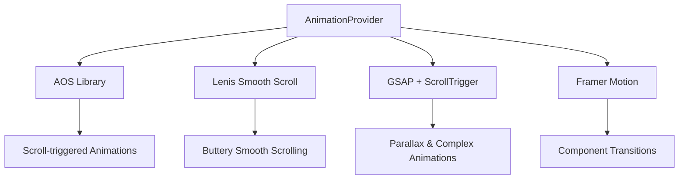

# English Ways 🎓

A modern, interactive web application designed to promote English language learning services with a focus on engaging UI/UX, smooth animations, and conversion optimization.

   

## 🌟 Features

### 📚 Core Functionality
- **Hero Section**: Compelling introduction with value proposition
- **Course Catalog**: Comprehensive display of available English courses
- **Field Offerings**: Specialized English training for specific industries
- **Benefits & Features**: Program advantages and unique selling points
- **Testimonials & Success Stories**: Social proof and credibility building
- **FAQ Section**: Addressing common student concerns
- **Registration System**: Lead capture and conversion optimization
- **Payment Integration**: Secure payment modal with 30% discount offer

### 🎨 User Experience
- **Smooth Animations**: GSAP, AOS, and Framer Motion powered interactions
- **Responsive Design**: Mobile-first approach with Tailwind CSS
- **Smooth Scrolling**: Lenis library for buttery smooth navigation
- **Exit Intent Modal**: User retention and conversion optimization
- **Floating CTA**: Persistent call-to-action for maximum visibility
- **Arabic/RTL Support**: Full right-to-left text support

### 🔧 Technical Features
- **IP Geolocation**: 5-service fallback system with 95-99% accuracy
- **Visitor Analytics**: Comprehensive user tracking and analytics
- **SEO Optimized**: Proper meta tags and semantic HTML
- **Performance Optimized**: Vite-powered build with code splitting
- **Type Safe**: Full TypeScript implementation

## 🏗️ Architecture

### Component Structure
```
src/
├── components/
│   ├── Hero.tsx                 # Landing banner with proof bubbles
│   ├── Navbar.tsx              # Responsive navigation with dropdown
│   ├── SideNavigation.tsx      # Mobile-friendly side drawer
│   ├── Courses.tsx             # Course catalog display
│   ├── FieldOfferings.tsx      # Industry-specific training
│   ├── Features.tsx            # Feature highlighting
│   ├── Benefits.tsx            # Program benefits
│   ├── Testimonials.tsx        # Customer testimonials
│   ├── SuccessStory.tsx        # Featured success cases
│   ├── Achievements.tsx        # Statistics and milestones
│   ├── TargetAudience.tsx      # Audience segmentation
│   ├── Process.tsx             # Learning process explanation
│   ├── SpecialOffer.tsx        # Promotional offers
│   ├── RemoveObstacles.tsx     # Objection handling
│   ├── FAQ.tsx                 # Frequently asked questions
│   ├── RegistrationSection.tsx # Lead capture form
│   ├── ThankYou.tsx            # Post-registration success page
│   ├── PaymentModal.tsx        # Payment processing interface
│   ├── FloatingCTA.tsx         # Persistent call-to-action
│   ├── ExitIntentModal.tsx     # Exit intent retention
│   ├── TrustBar.tsx            # Trust signals and badges
│   └── AnimationProvider.tsx   # Animation system coordinator
├── utils/
│   ├── scrollUtils.ts          # Smooth scrolling utilities
│   └── visitorInfo.ts          # IP geolocation & analytics
├── App.tsx                     # Main application component
├── main.tsx                    # Application entry point
└── index.css                   # Global styles and fonts
```

### Technology Stack

**Core Technologies:**
- **React 18.2.0** - Component-based UI library
- **TypeScript 5.2.2** - Type safety and developer experience
- **Vite 4.5.0** - Fast build tool and dev server
- **React Router DOM 7.8.2** - Client-side routing

**Styling & UI:**
- **Tailwind CSS 3.3.5** - Utility-first CSS framework
- **PostCSS 8.4.31** - CSS processing
- **Autoprefixer 10.4.16** - CSS vendor prefixing
- **Lucide React** - Modern icon library
- **React Icons** - Popular icon sets
- **Font Awesome** - Brand icons

**Animations & Interactions:**
- **GSAP 3.13.0** - Professional-grade animations
- **AOS 2.3.4** - Animate On Scroll library
- **Framer Motion 10.16.4** - React animation library
- **Lenis 1.3.8** - Smooth scrolling implementation
- **React Fast Marquee** - Smooth marquee animations

## 🚀 Getting Started

### Prerequisites
- **Node.js** (v16 or higher)
- **npm** or **yarn**
- Modern web browser

### Installation

1. **Clone the repository:**
```bash
git clone <repository-url>
cd english-ways
```

2. **Install dependencies:**
```bash
npm install
```

3. **Start development server:**
```bash
npm run dev
```

4. **Open your browser:**
Navigate to `http://localhost:5173`

### Available Scripts

| Command | Description |
|---------|-------------|
| `npm run dev` | Start development server |
| `npm run build` | Build for production |
| `npm run preview` | Preview production build |
| `npm run test:responsive` | Responsive design testing guide |
| `npm run analyze` | Analyze bundle size |

## 📱 Responsive Design

The application is built with a mobile-first approach and supports:

- **Mobile** (320px - 768px): Optimized touch interface
- **Tablet** (768px - 1024px): Enhanced layout with better spacing
- **Desktop** (1024px+): Full-featured experience with multi-column layouts

### Testing Responsive Design
```bash
npm run test:responsive
```

## 🎨 Animation System

### Animation Libraries Integration
The application uses a sophisticated animation system coordinated by `AnimationProvider`:



### Animation Types
1. **Scroll-based Animations**: Triggered as elements enter viewport
2. **Smooth Scrolling**: Enhanced page navigation experience
3. **Micro-interactions**: Button hovers, form interactions
4. **Background Animations**: Morphing blobs and floating elements
5. **Text Animations**: Reveal effects and gradient text

## 🌍 IP Geolocation System

### Advanced Geolocation Features
- **5-Service Fallback System**: Ensures 95-99% accuracy
- **Comprehensive Logging**: Detailed debugging information
- **Timeout Protection**: Prevents hanging requests
- **Quality Validation**: Ensures meaningful data before acceptance

### Supported Services
1. **IPGeolocation.io** - Primary service with high accuracy
2. **Abstract API** - Reliable backup with good free tier
3. **IPapi.co** - Established service for compatibility
4. **IPinfo.io** - Industry standard with probe network
5. **IP-API.com** - Final fallback option

## 🔧 Configuration

### Environment Setup
The project includes several configuration files:

- **`vite.config.ts`** - Vite build configuration
- **`tailwind.config.js`** - Design system and custom styles
- **`postcss.config.js`** - CSS processing configuration
- **`vercel.json`** - Deployment configuration for SPA routing

### Custom Tailwind Colors
```javascript
colors: {
  canvas: '#F8F9FA',
  primary: '#635DFF',
  charcoal: '#111827',
  accent: '#FFF7ED',
  border: '#E5E7EB',
}
```

## 📊 Performance & Analytics

### Visitor Information Collection
The application includes comprehensive visitor analytics:
- **IP Geolocation**: Country, region, city detection
- **Device Information**: Browser, OS, screen resolution
- **User Behavior**: Interaction tracking and conversion metrics

### Performance Optimizations
- **Code Splitting**: Automatic route-based splitting via Vite
- **Image Optimization**: Responsive images with proper loading
- **CSS Optimization**: Tailwind CSS purging and minification
- **Animation Performance**: Hardware acceleration and efficient rendering

## 🚀 Deployment

### Production Build
```bash
npm run build
```

### Deployment Platforms
The application is optimized for:
- **Vercel** (Recommended) - Includes `vercel.json` for SPA routing
- **Netlify** - Static site hosting
- **GitHub Pages** - Free hosting option

### SPA Routing Configuration
For proper client-side routing, ensure your hosting platform redirects all routes to `index.html`:

```json
{
  "rewrites": [
    {
      "source": "/(.*)",
      "destination": "/index.html"
    }
  ]
}
```

## 🧪 Testing

### Manual Testing Checklist
- [ ] Responsive design across devices
- [ ] Smooth scrolling functionality
- [ ] Animation performance
- [ ] Form submissions
- [ ] Payment modal interactions
- [ ] Cross-browser compatibility

### Performance Testing
Use the bundle analyzer to monitor build size:
```bash
npm run analyze
```

## 📋 Browser Support

- **Chrome** 90+
- **Firefox** 88+
- **Safari** 14+
- **Edge** 90+

## 🤝 Contributing

1. Fork the repository
2. Create a feature branch (`git checkout -b feature/AmazingFeature`)
3. Commit your changes (`git commit -m 'Add some AmazingFeature'`)
4. Push to the branch (`git push origin feature/AmazingFeature`)
5. Open a Pull Request

## 📄 License

This project is proprietary and confidential.

## 🆘 Support

For support and questions:
- 📧 Contact: [Your Email]
- 💬 WhatsApp: [WhatsApp Link]
- 🌐 Website: [Website URL]

## 🎯 Key Performance Indicators

- **Conversion Rate**: Registration form completion
- **User Engagement**: Scroll depth and time on page
- **Technical Performance**: Page load speed and animation smoothness
- **Geographic Reach**: Visitor location tracking accuracy

---

**English Ways** - Learn English the Right Way 🚀

*Built with ❤️ using React, TypeScript, and modern web technologies*